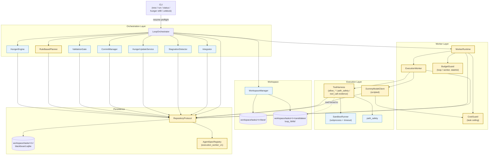

# HungerLoop v0.5a — Architecture Overview

**Status**: Draft for v0.5a implementation
**Date**: 2026-05-02
**Scope**: First runnable agent loop with persistence, single ExecutionWorker, DummyModelClient
**Inputs**: `hungerloop_v0_5_2_prd.md` §1–§28; v0.4.1 source under `src/hungerloop/`

---

## 1. Requirements

### 1.1 Functional (from PRD §0 / §2.1)

- **F1** `hungerloop new` creates a task with hunger ledger persisted in SQLite.
- **F2** `hungerloop run` executes loops until a `StopReason` is reached, persists state across process restarts.
- **F3** `hungerloop status` reads task state without mutating it.
- **F4** `hungerloop hunger refill / unblock / freeze / resume` mutate hunger state out-of-band.
- **F5** Loop iteration: HungerEngine.tick → RuleBasedPlanner → WorkerRuntime → ExecutionWorker → Integrator → ValidationGate → CommitManager → HungerUpdate → StagnationDetector → LoopTrace.
- **F6** All seven `StopReason` values produce a complete `StopReport`.
- **F7** Resume is non-destructive: `--resume` preserves cost/loop_count; `--reset` creates a new task_id.

### 1.2 Non-functional

| ID | NFR | How v0.5a satisfies it |
|---|---|---|
| **N1 Recoverability** | Process crash mid-loop must not corrupt state | SQLite per-task DB; `clock.loop_count++` written before worker dispatch (PRD §4.2 / §28.4); failed loops still count |
| **N2 Isolation** | Workers cannot mutate `best/` or escape candidate workspace | `WorkspaceManager` + `path_safety.resolve_workspace_path` + `ToolHarness.allow_*` enforcement (PRD §28.11) |
| **N3 Cost containment** | Spend cannot exceed task ceiling; phase budget enforced | Two-tier: `CostGuard` (task) + `BudgetGuard` (loop/worker, stateful — PRD §28.4) |
| **N4 Observability** | Every loop and stop produces queryable artifacts | `LoopTrace` + `StopReport` history (PRD §28.15) + `events` table with `task_id`/`loop_id` (PRD §28.14) + typed evidence (`EvidenceType` enum) |
| **N5 Type safety** | `mypy --strict` clean; no `repo: Any` in services | `RepositoryProtocol` strict; all 13 services typed (PRD §28.10) |
| **N6 Testability** | No network in unit tests; demo deterministic | `DummyModelClient` scripted (PRD §28.1); SQLite uses `:memory:` in tests; InMemoryRepository retained for unit tests |
| **N7 Safety stop** | Cost ceiling stops within one tool/LLM call | `CostGuard.assert_within_budget` pre + post each call; HungerEngine.tick converts to `SAFETY_STOP` (PRD §3.2) |

### 1.3 Constraints (out of scope for v0.5a)

- No real LLM (DummyModelClient only); OpenAIModelClient ships in v0.5b.
- No multi-worker concurrency; `RuleBasedPlanner` produces ≤1 assignment.
- No memory promotion; only candidate generation in v0.5c.
- Single-process orchestrator; no distributed coordination.

---

## 2. Component Diagram



**Legend** — yellow = new in v0.5a; blue = exists in v0.4.1.

---

## 3. Data Flow — One Accepted Loop

```mermaid
sequenceDiagram
    autonumber
    participant CLI
    participant Orc as LoopOrchestrator
    participant Repo as RepositoryProtocol
    participant HE as HungerEngine
    participant RBP as RuleBasedPlanner
    participant WM as WorkspaceManager
    participant WR as WorkerRuntime
    participant EW as ExecutionWorker
    participant MC as ModelClient
    participant TH as ToolHarness
    participant VG as ValidationGate
    participant CM as CommitManager

    CLI->>Repo: get_last_stop_reason(task)
    Note over CLI: resume preflight (PRD §18.3)
    CLI->>Orc: step(task)

    Orc->>Repo: get_hunger_policy/clock/ledger
    Orc->>HE: tick(...)
    HE-->>Orc: HungerSnapshot
    alt should_stop
        Orc-->>CLI: StopReport
        CLI->>Repo: save_stop_report(latest + history)
    end

    Orc->>Repo: next_loop_id(task)
    Orc->>Repo: clock.loop_count++; save_hunger_clock
    Note over Orc,Repo: Loop budget consumed at start (NFR N1)

    Orc->>WM: create_candidate_workspace(task, loop_id)
    Orc->>RBP: plan(task, loop_id, snapshot, budget)
    RBP-->>Orc: LoopPlan(1 assignment to execution_worker_v1)

    alt empty plan
        Orc->>WM: reject_candidate
        Orc->>Repo: increment_no_progress_streak
        Note over Orc: NOT immediate BLOCKED (PRD §28 / M5)
    end

    Orc->>WR: run(spec, context, candidate_root)
    WR->>WR: BudgetGuard.reset(task, loop_id, agent)
    WR->>EW: run(context, candidate_root)
    EW->>MC: complete_json(task_id, ..., max_retries)
    Note over MC: retry loop inside ModelClient (ADR-004)
    MC-->>EW: ModelResponse(actions=[...])
    loop for each action
        EW->>TH: execute(tool_name, args, budget, candidate_root)
        TH->>TH: assert allow_shell/file_write/network
        TH->>TH: resolve_workspace_path
        TH-->>EW: ToolResult(evidence_id, artifact_id)
    end
    EW-->>WR: WorkerResult
    WR-->>Orc: WorkerResult

    Orc->>Repo: save_worker_result
    Orc->>Orc: Integrator.integrate → CandidateState
    Orc->>VG: validate(target_items)
    VG-->>Orc: ValidationReport
    Orc->>CM: apply(candidate, report)
    alt commit
        CM->>WM: promote_candidate_to_best
        CM->>Repo: save_best_state + save_accepted_check (M9)
    else reject
        CM->>WM: reject_candidate
    end
    Orc->>Orc: HungerUpdate.apply_validation
    Orc->>Orc: StagnationDetector.update
    Orc->>Repo: save_loop_trace
    Orc-->>CLI: LoopTrace
```

---

## 4. Layering & Boundaries

```text
┌──────────────────────────────────────────────────────────┐
│ CLI (click commands; resume preflight; no business logic) │
├──────────────────────────────────────────────────────────┤
│ Orchestration: LoopOrchestrator                          │
│   - drives lifecycle, owns stop_reason routing           │
├──────────────────────────────────────────────────────────┤
│ Coordination services (stateless wrt persistence):       │
│   HungerEngine • RuleBasedPlanner • Integrator           │
│   ValidationGate • CommitManager • HungerUpdateService   │
│   StagnationDetector                                     │
├──────────────────────────────────────────────────────────┤
│ Worker layer:                                            │
│   WorkerRuntime — thick wrapper (ADR-002 stateful guard) │
│   ExecutionWorker                                        │
├──────────────────────────────────────────────────────────┤
│ Execution layer:                                         │
│   ModelClient (retry inside — ADR-004)                   │
│   ToolHarness (policy)  →  SandboxRunner (subprocess)    │
│   path_safety (utility)                                  │
├──────────────────────────────────────────────────────────┤
│ Persistence: RepositoryProtocol → SQLiteRepository       │
│   (single fat protocol — ADR-006)                        │
├──────────────────────────────────────────────────────────┤
│ Storage: workspace/tasks/<task_id>/{blackboard.sqlite,   │
│          best/, candidates/loop_NNN/}                    │
└──────────────────────────────────────────────────────────┘
```

**Inviolable rules**:

1. Workers do NOT touch `RepositoryProtocol` for state mutation; they return `WorkerResult` and let the Orchestrator write.
2. ToolHarness is the **only** entry to filesystem/shell from workers. SandboxRunner accepts argv only; never shell strings.
3. CommitManager is the **only** writer of `BestState`. WorkspaceManager is the only mover of `candidates/loop_NNN/` → `best/`.
4. ModelClient is the **only** thing that calls external network APIs. ToolHarness's `allow_network` flag gates this from the worker side.

---

## 5. Failure Modes & Mitigations

| Failure | Detection | Mitigation |
|---|---|---|
| Process crashed mid-loop | SQLite WAL replay on next start; `clock.loop_count` already advanced | Loop is treated as "consumed"; Orchestrator computes next snapshot fresh. Idempotency: candidate workspace is rejected on resume since no validation report exists. |
| ModelClient rate-limited (429) | `ModelRateLimitError` raised | Retry inside ModelClient honoring `Retry-After` (ADR-004) |
| ModelClient auth failure (401/403) | `ModelAuthError` (subclass, retryable=False) | WorkerResult.requires_human=True → `StopReason.HUMAN_REQUIRED` |
| Tool budget exceeded | `WorkerBudgetExceeded` from BudgetGuard | WorkerResult.error_type="worker_budget_exceeded"; loop counted as no-progress |
| Worker timeout (LLM/subprocess hangs) | `asyncio.wait_for` in WorkerRuntime | WorkerResult.error="worker_timeout"; counted by StagnationDetector |
| All items BLOCKED | HungerEngine.tick → `StopReason.BLOCKED` | Requires `hungerloop hunger unblock` to resume (PRD §15) |
| Cost ceiling hit during call | `SafetyStopError` from CostGuard.record_llm_usage | Orchestrator catches → reject candidate → `StopReport(SAFETY_STOP)` |
| Demo file_exists never satisfied (M21) | Validation FAIL N times → stagnation BLOCKED | Mitigated by scripted DummyModelClient (PRD §28.1) producing `write_file: report.md` action |
| SQLite corruption | Foreign-key violation or broken JSON in payload column | Treat as `StopReason.ERROR`; require `--reset` (creates new task_id, original data preserved) |
| Concurrent `run` of same task | SQLite `BEGIN IMMEDIATE` will block | CLI takes file lock on `blackboard.sqlite` (advisory) before invoking Orchestrator |

---

## 6. Risks

| Risk | Likelihood | Impact | Mitigation |
|---|---|---|---|
| `RepositoryProtocol` grows unbounded as features land | High | Medium | ADR-006 acknowledges this; revisit split at v0.6 when LearningWorker/ResearchWorker land. |
| `BudgetGuard` in-memory state lost on crash means partial loop usage isn't audited | Medium | Low | Loop is single-process; loop_count consumed at start so the budget is "spent" anyway from accounting POV. |
| SQLite single-file per task makes cross-task analytics expensive | Low | Low | v0.5a doesn't need cross-task analytics; v0.6+ can add an aggregation script over JSONL `events` exports. |
| `--reset` task_id naming collides if user manually creates `<x>__r1` | Very Low | Low | `next_reset_generation` query checks max existing N before assigning. |
| DummyModelClient scripted responses drift from real LLM behavior | High | Medium | Demo + smoke tests gate v0.5b real-model integration; OpenAIModelClient unit tests use httpx mock. |
| Workers bypass ToolHarness by importing `subprocess` directly | Medium | High | Add lint rule (`ruff` custom check) banning `subprocess` / `os.system` import outside `services/sandbox_runner.py`. |

---

## 7. ADR Index

| ADR | Title | Status |
|---|---|---|
| [ADR-001](adr/ADR-001-sqlite-persistence.md) | SQLite per-task as v0.5a persistence | Accepted (2026-05-02) |
| [ADR-002](adr/ADR-002-budget-guard-state.md) | BudgetGuard state is process-local in-memory | Accepted (2026-05-02) |
| [ADR-003](adr/ADR-003-toolharness-sandbox-layering.md) | ToolHarness is policy; SandboxRunner is execution | Accepted (2026-05-02) |
| [ADR-004](adr/ADR-004-modelclient-owns-retry.md) | ModelClient owns retry; WorkerRuntime catches once | Accepted (2026-05-02) |
| [ADR-005](adr/ADR-005-reset-new-task-id.md) | `--reset` creates new task_id; no generation column | Accepted (2026-05-02) |
| [ADR-006](adr/ADR-006-single-repository-protocol.md) | Single RepositoryProtocol (fat interface) | Accepted (2026-05-02) |

---

## 8. Resolved Open Questions

The four open questions were resolved on 2026-05-02:

1. **CLI lock granularity** — **Decision: per-task advisory file lock on `blackboard.sqlite` via `fcntl.flock`.** SQLiteRepository acquires `LOCK_EX | LOCK_NB` on open and releases on close; concurrent `hungerloop run <same-task>` exits with an actionable error. Cross-task concurrency is unaffected. Folded into ADR-001 compliance.
2. **Events table vs `events.jsonl`** — **Decision: SQLite `events` table only.** PRD §18.1's reference to `events.jsonl` is removed. Single source of truth; queryable; no dual-write consistency problem.
3. **AgentSpec persistence** — **Decision: code-only `AgentSpecRegistry` for v0.5a.** `agent_specs` SQLite table is created by the schema (forward-compat) but unused; `repo.get_agent_spec(...)` resolves from the in-process registry. Dynamic registry deferred to v0.6.
4. **Workspace size limits** — **Decision: deferred to v0.5b.** Orthogonal to v0.5a architecture; will be implemented as a `WorkspaceManager` post-write check against `BudgetAllocation.max_workspace_bytes` (new field in v0.5b).
